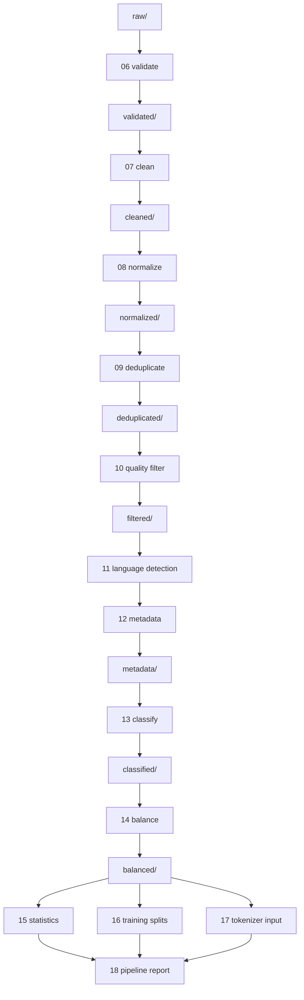

# CognitiveOC Corpus Processing Pipeline

This document describes the deterministic post-acquisition corpus processing pipeline implemented in `corpus/corpus_wharehouse`.

## Scope

Stages `06` through `19` transform downloaded raw datasets into a frozen, versionable training corpus without overwriting raw artifacts.

## Execution flow

## Design properties

- Deterministic IDs and stable split ordering via SHA-256 seeded ordering.
- Idempotent stage outputs: each stage writes to its own directory.
- Resumable execution through output existence checks and persisted manifests in `pipeline_state/`.
- Structured JSONL logs under `logs/`.
- Raw data preservation: no stage mutates `raw/`.
- Streaming-oriented architecture: file-by-file transforms, tokenizer chunking, and split generation avoid full in-memory concatenation.

## Stage summary

- `06_validate_corpus.py`: integrity, checksum, and manifest creation for raw inputs.
- `07_clean_corpus.py`: removes markup/noise and normalizes whitespace/punctuation.
- `08_normalize_corpus.py`: canonical JSON schema per document.
- `09_deduplicate_corpus.py`: exact/near/semantic duplicate removal with SQLite-backed state.
- `10_quality_filter.py`: heuristic quality scoring and rejection.
- `11_language_detection.py`: language annotations.
- `12_generate_metadata.py`: immutable metadata attachment.
- `13_classify_corpus.py`: multi-label heuristic classification.
- `14_balance_corpus.py`: deterministic bucket balancing.
- `15_corpus_statistics.py`: corpus counts and distributions.
- `16_build_training_splits.py`: train/validation/test/benchmark JSONL creation.
- `17_prepare_tokenizer_input.py`: deterministic tokenizer chunks and manifest.
- `18_pipeline_report.py`: consolidated readiness report.
- `19_run_processing_pipeline.py`: orchestration runner.

## Readiness assessment

Current implementation is suitable as a deterministic baseline for workstation execution and extension to shard-aware cloud jobs. Before large-scale tokenizer training, the project should still connect source manifests into metadata, benchmark actual throughput on target hardware, and calibrate deduplication and quality thresholds against representative samples.

## Remaining steps before tokenizer training

1. Map acquisition manifests into immutable per-document license/source metadata.
2. Run a large real-corpus dry run and profile CPU, IO, SQLite, and chunk-size behavior.
3. Calibrate near-duplicate and quality thresholds using sampled human review.
4. Freeze a versioned release manifest for `balanced/`, `splits/`, and `tokenizer_input/`.
5. Add shard-merging and distributed execution adapters for cloud-scale corpus volume.
